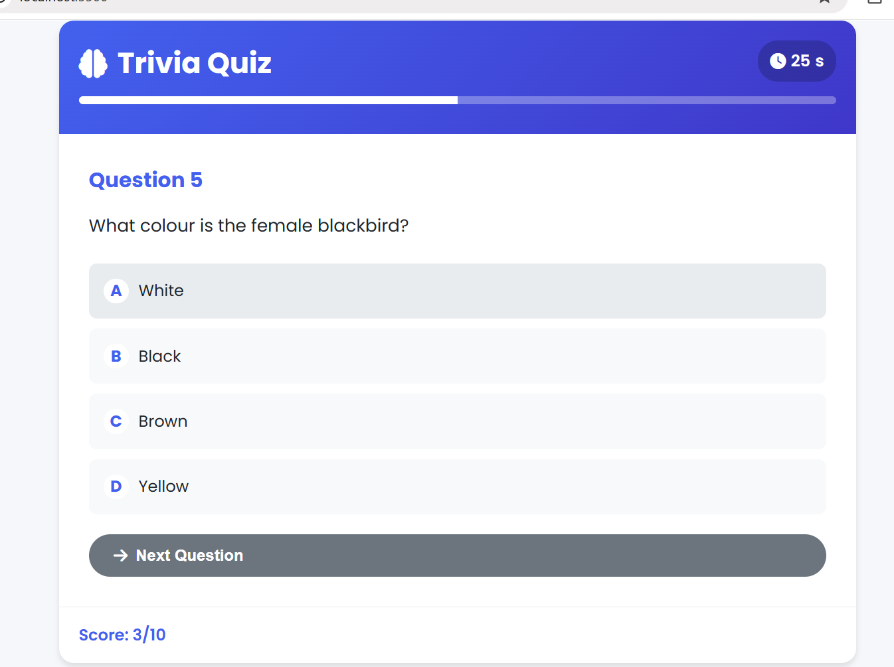

# 🎯 Trivia Quiz Challenge




> A responsive single-page trivia quiz application built with HTML, CSS, and JavaScript

## 🚀 Features

- ✔️ Multiple-choice questions from Open Trivia API  
- ⏱️ 30-second timer per question  
- 📈 Real-time score tracking  
- 🔍 Detailed answer explanations  
- 🎚️ Customizable quiz settings  
- 📱 Fully mobile-responsive design  

## 🛠️ Technologies

```plaintext
- Frontend: HTML5, CSS3, JavaScript (ES6+)
- API: Open Trivia Database
- Icons: Font Awesome
- Deployment: GitHub Pages

Installation
Clone the repository:

bash
Copy
git clone https://github.com/your-username/trivia-quiz-game.git
cd trivia-quiz-game
Switch to gh-pages branch (for deployment):

bash
Copy
git checkout gh-pages